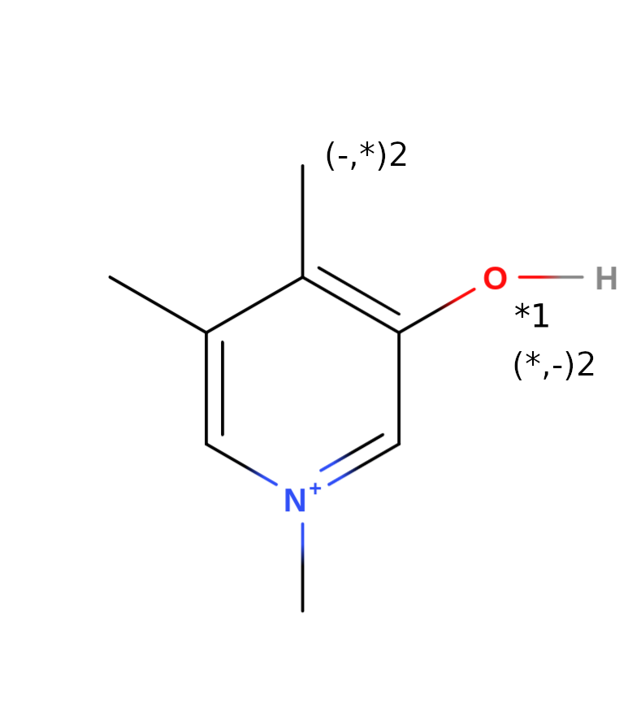
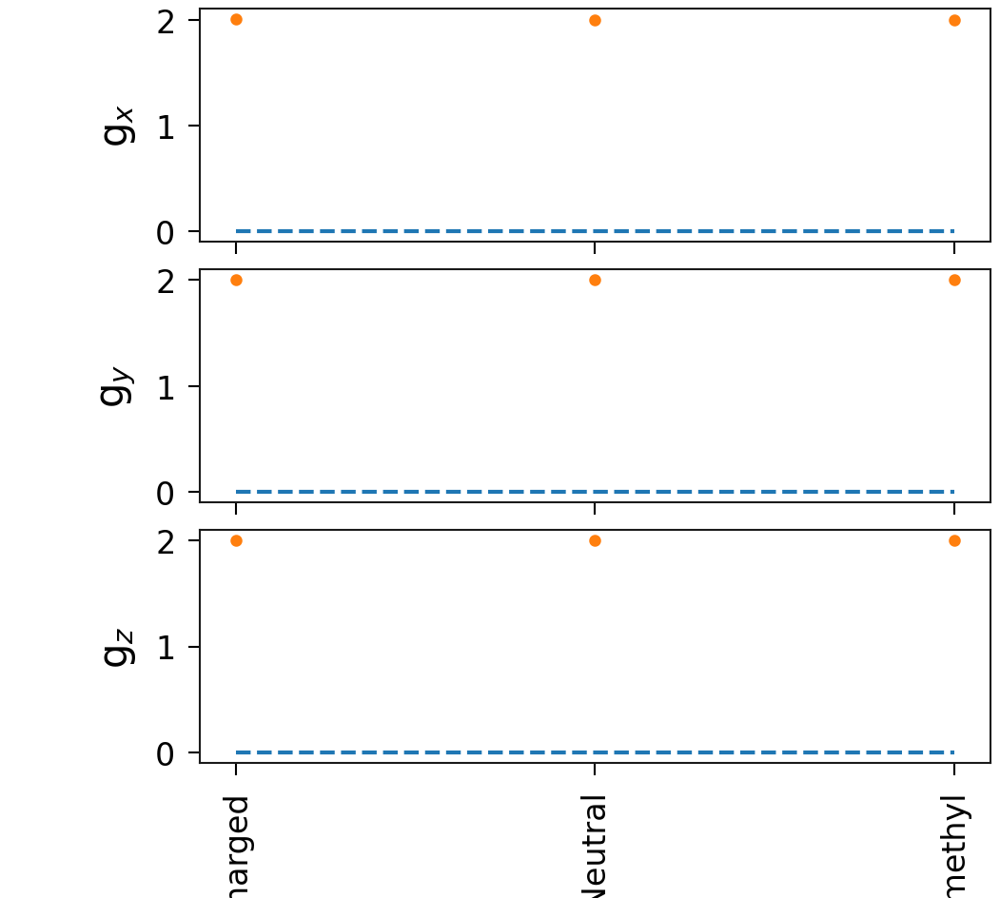

# Title

Briefly describe your system

## PYD

  

  

| System                                              | $g_x$     | $g_y$     | $g_z$     | Max absolute error | Mean absolute error |
|-----------------------------------------------------|-----------|-----------|-----------|--------------------|---------------------|
| Experiment                                          | 0.0       | 0.0       | 0.0       |                    |                     |
| [1-OxygenCharged](PYD/1-OxygenCharged/vmd_image.md) | 2.0142364 | 2.0048491 | 2.0021187 | 2.0142364          | 2.0070681           |
| [2-OxygenNeutral](PYD/2-OxygenNeutral/vmd_image.md) | 2.0052018 | 2.0040755 | 2.0021459 | 2.0052018          | 2.0038077           |
| [3-methyl](PYD/3-methyl/vmd_image.md)               | 2.0030704 | 2.0027025 | 2.0022938 | 2.0030704          | 2.0026889           |

# Fitting with the best candidates

Given that the set of candidates could be large, this section filters the
candidates to those that contribute to the fitting with a minimum of the 5
percent. It also shows the percentage per candidates in tables.

## Best fit

  

| System | Percentage |
|--------|------------|
| [ PYD/2-OxygenNeutral ](./PYD/2-OxygenNeutral/vmd_image.md) | 70.03751698946618 |
| [ PYD/1-OxygenCharged ](./PYD/1-OxygenCharged/vmd_image.md) | 29.96248301053382 |
